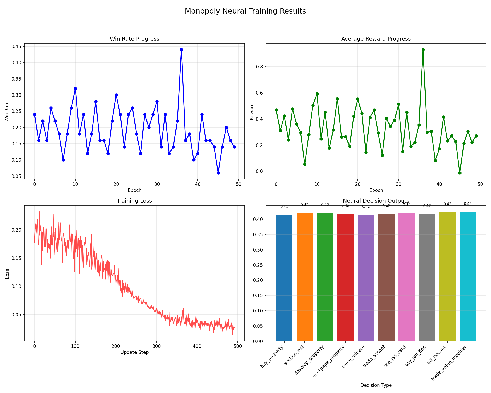

# Deep-Monopoly: Reinforcement Learning för Optimala Monopolstrategier

## Sammanfattning
Deep-Monopoly är ett projekt som utforskar hur maskininlärning kan användas för att utveckla optimala spelstrategier för Monopol. Projektet kombinerar klassisk spelimplementering med deep reinforcement learning för att skapa en AI som kan lära sig spela Monopol på en avancerad nivå.

## Bakgrund och målsättning
Inspirerat av framgångar inom AI för spel som schack och Go, var målet att utveckla en AI som kan bemästra Monopol - ett spel som presenterar unika utmaningar genom sin kombination av slumpelement, ofullständig information och långsiktiga strategier. Ursprungligen planerades en kombination av Deep Q-Learning och Monte Carlo Tree Search (MCTS), men implementeringen fokuserade på en standardiserad deep reinforcement learning-approach.

## Metod

### Spelutveckling
1. **Grunden**: Implementerade först ett enkelt textbaserat Monopolspel med robust klasstruktur och modulär kod
2. **Avancerade funktioner**: Byggde funktionalitet för husbyggande, auktioner, fastighetshandel och inteckning
3. **Regelbaserade bottar**: Utvecklade bottar med programmatiska strategier och modifierbara parametrar
4. **Användarupplevelse och statistik**: Förbättrade gränssnittet och implementerade statistikspårning för vinster, förluster och spelardata

### AI-implementation
1. **Neural Bot**: Skapade en neural agent implementerad i PyTorch
2. **Tillståndsrepresentation**: Utformade en "state representation" som input till neuralnätverket, med information om spelarens position, pengar, fastigheter och motståndares tillgångar
3. **Aktionsrepresentation**: Skapade output-lager för olika möjliga beslut som köp av fastigheter, budgivning och husbyggande
4. **Träningsmetoder**: Implementerade:
    - Träning mot regelbaserade bottar
    - Självspelande turnering med modifierade varianter av modellen
    - Replay buffer för att lagra och lära från tidigare erfarenheter
5. **Belöningsfunktion**: Utformade en reward function baserad på:
    - Pengatillgångar
    - Fastighetsinnehav
    - Monopolbildning
    - Förändringar i vinstprobabilitet

## Resultat
Implementeringen fungerar tekniskt, men träningsresultaten har inte varit optimala. Neurala agenter kan spela mot regelbaserade bottar, men visar begränsad strategisk förmåga. Belöningsfunktionen lyckas inte fullt ut länka tidiga beslut till slutligt resultat, vilket är en central utmaning i Monopol.

## Upptäckta Monopolstrategier
Under projektets gång identifierades flera effektiva strategier för Monopol:

1. **Hus-fokuserad strategi**:
   - Fokusera på att få tre hus så snabbt som möjligt (hyra > 500 sätter motståndare i ekonomiska svårigheter)
   - Billigare fastighetsgrupper ger snabbare avkastning på investeringar
   - Blå och bruna fastigheter kräver bara två fastigheter för monopol, vilket ger snabbare utvecklingsmöjligheter

2. **Ekonomisk strategi**:
   - Likvida medel är viktigare än enstaka fastigheter utan monopol
   - Inteckna fastigheter vid behov för att bygga hus, men sälj aldrig redan byggda hus
   - Håll alltid tillräcklig likviditet för att betala potentiella höga hyror

3. **Handelsstrategier**:
   - Strategiskt utbyte där motståndare får två monopol och du får ett, men där ditt har bättre byggpotential
   - "Defensiv handel" för att förhindra motståndare från att bilda monopol
   - Spara pengar för auktioner när andra spelare har låg likviditet

4. **Taktiska överväganden**:
   - Tågstationer är värdefulla bara om du har tre eller fyra
   - El- och vattenverken ger sällan god avkastning
   - Köp hus strategiskt när motståndare närmar sig dina fastigheter
   - Fängelse är fördelaktigt i slutet av spelet när hyror är höga
   - Kort-räkning ger fördel (memorera vilka chans- och allmänningskort som använts)

## Utmaningar
- **Fördröjd belöning**: Monopol har extremt långa kedjor mellan beslut och konsekvenser
- **Dimensionalitet**: Spelets stora tillståndsrymd gör effektiv utforskning svår
- **Slumpelement**: Tärningskast och kort skapar hög variabilitet i utfall
- **Prestandaproblem**: Spelets komplexitet och simuleringshastighet begränsar träningsmängden

## Utvecklingspotential
1. **Förbättrade träningsmetoder**:
    - Längre träningstid
    - Implementering av Monte Carlo Tree Search
    - Progressiv curriculumträning
2. **Förbättrad belöningssignal**:
    - Vinstbaserad belöning istället för tillståndsbaserad
    - Inverse reinforcement learning från mänskliga spelare
3. **Tekniska förbättringar**:
    - ELO-system för bot-benchmarking
    - Prestandaoptimering
    - Parallelliserad träning
4. **Utvärderingsmetodik**:
    - Mer omfattande testning mot olika motståndare
    - Analys av specifika strategiska mönster

## Slutsats
Deep-Monopoly demonstrerar utmaningarna med att tillämpa reinforcement learning på komplexa brädspel med stokastiska element. Trots begränsade resultat ger projektet värdefulla insikter om hur man kan representera och modellera Monopol för maskininlärning, och lägger grunden för framtida förbättringar genom mer avancerade algoritmer och beräkningsresurser.

